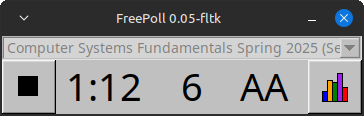

# FreePoll

This is a somewhat experimental attempt to create an open source client program
for the [iClicker](https://www.iclicker.com/) system for classroom
polling.



FreePoll exists because I wanted an open source program that I could
use to run clicker quizzes from a Linux system.

If you're interested in trying out FreePoll, first [compile it](#compilation),
then you can refer to the [Guide](guide.md) for details on how to use it.

On Linux, FreePoll is reasonably robust and stable. Please do
[let me know](#contact) if you run into any bugs, though.

A small amount of progress towards allowing FreePoll to work on Windows
has been made, but it's not functional yet.

## Who might find FreePoll useful?

If you use [Peer Instruction](https://mazur.harvard.edu/research-areas/peer-instruction)
in your teaching, and you either run Linux or prefer to use open source software,
FreePoll might be useful to you.  See the [Why](#why) section for some more
background.

## Compilation

### Compilation on Linux

FreePoll currently only works fully on Linux, and has only been tested
on Ubuntu 22.04.

On Linux, you will need

* g++
* make
* the libusb/hidapi development package
* the wxWidgets GTK3 development package

On Debian or Ubuntu:

```
sudo apt install g++ make libhidapi-dev libwxgtk3.0-gtk3-dev
```

To compile the program:

```
make depend
make -j
```

(The `-j` option is just so `make` uses all of your CPU cores.)

Two executables will be built in the `build` directory.

The `freepoll-gui` executable is probably the one you want to use.
The [Guide](guide.md) explains how to configure and use this program.

The `freepoll` executable is a very simple command line utility that
runs a poll and writes the results to a CSV file. You wil need
to use control-C to end the poll. (The functionality of this program
is modeled on [iclickerpoll](https://github.com/siefkenj/iclickerpoll).)

### Compilation on Windows (experimental!)

A very preliminary effort to get FreePoll working on Windows has been started.
Note that FreePoll doesn't actually work on Windows yet. (Help making
this happen would be appreciated!)

You need MSYS2: <https://www.msys2.org/>

Install the compiler tools:

```
pacman -S --needed base-devel mingw-w64-x86_64-toolchain
```

Install wxWidgets and the hidapi libraries:

```
pacman -S mingw-w64-x86_64-wxWidgets
pacman -S mingw-w64-x86_64-hidapi
```

Compile the code:

```
make depend
make -j
```

## Why?

The basic premise of clickers is pretty simple. You show students a
multiple choice quiz question, let them think about the question,
and answer individually by pressing one of the buttons (A through E)
on their clickers.  After the individual response, students discuss
the question in small peer groups, and then answer again. Clickers
are simply a way for the instructor to record student responses.

The iClicker hardware is quite nice. The student remotes are
reasonably inexpensive and fairly robust. The base station
connects to a computer using USB, and allows the student responses
to be recorded.

The problem is the iClicker *software*.  I have two main complaints.

First, Linux is no longer a supported operating system. In theory, the
[iClicker Classic](https://www.iclicker.com/downloads/iclicker-classic/)
software works on Linux. In practice, it doesn't run on any recent version
of Linux (at least in my experience.)

Second, the modern [iClicker Cloud](https://www.iclicker.com/instructors/software/iclicker-cloud/)
software (which does not run on Linux systems at all) only supports storing
the collected data remotely (in the "cloud").
So, the instructor must create an account to use it. Amazingly,
the data available for download does not actually contain the student
responses! At best, you can see who participated, and if you've
indicated which are the correct answers, you can find out who answered
the question correctly. But you can't actually find out which specific
choices the students made in their responses! (I am trying to avoid going
into an extended rant about how frustrating this is. Suffice it to say
that I think this is a ridiculous limitation.)

So, what I want is a portable, open source client program that gives
me full access to the students' responses.  This is what FreePoll
is intended to be.

## Technical details

[Jason Siefken](https://www.math.toronto.edu/siefkenj/homepage/index.html)
already did the hard part, which is reverse-engineering enough of the
USB protocol that the iClicker base station uses to talk to the host PC
to allow polls to be run and responses collected. He created
[iclickerpoll](https://github.com/siefkenj/iclickerpoll), which is a
command line program written in Python which allows a single poll to be
run and the responses written to a CSV file.

My contribution was translating Jason's work to C++, and then writing
a simple GUI for running polls.  The GUI is implemented using
[wxWidgets](https://www.wxwidgets.org/).  Note that it's only been
tested on Linux using wxGTK.

The iClicker base station appears as a Human Interface Device (HID),
which is probably the easiest kind of USB device to communicate with.
FreePoll uses [libusb/hidapi](https://github.com/libusb/hidapi)
to talk to the base station, using the same approach as iclickerpoll.

## Limitations

Only alphabetic (choices A–E) polls are supported.

## License

FreePoll is distributed under the terms of the GNU General Public License
version 3.  See the [LICENSE](LICENSE) for details.

FreePoll includes code derived from [iclickerpoll](https://github.com/siefkenj/iclickerpoll).
It also uses [rapidcsv](https://github.com/d99kris/rapidcsv) to read CSV files,
and [argparse](https://github.com/stdbug/argparse) to parse command line
arguments.

## Contact

If you're interested in helping out, or have feedback, you can contact me at
<mailto:david.hovemeyer@gmail.com>.

