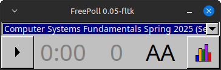

# Guide to using FreePoll

This document explains how to use FreePoll.

Note that this document assumes you are using Linux, which is the only
system FreePoll has been compiled on so far. It might support other OSes
in the future. (As of February 2024, some preliminary efforts have
been made to get it to work on Windows, but it's not functional yet.)

## Status of the software

<!--
As of the time of writing (August 7th, 2022), FreePoll hasn't yet been
used in anger. I'm planning to use it in my classes in the Fall 2022 semester.
I'm feeling reasonably confident that it will work acceptably.

As of August 29th, 2022, I am using FreePoll in two courses.
In the first two class meetings, FreePoll worked well (with two polls in
each class.) However, it's still early days, and it's possible there
are serious bugs I'm not yet aware of.
-->

As of September 29th, 2022 I have been using FreePoll in two courses
with up to 65 students participating in each poll, and I have not
run into any issues.  I have verified that student responses are recorded
for all students.  Therefore, I would consider FreePoll to be production
quality at this point.  Of course, as with all software, there
could be bugs. If you find any, [let me know](mailto:david.hovemeyer@gmail.com).

## udev rules

On Linux systems, FreePoll will access your iClicker base station using libusb/hidapi.
You will probably need to add a udev rule to allow an ordinary user account
to access the device. The file [udev/98-iclicker.rules](udev/98-iclicker.rules)
contains the udev rule I use on my laptop running Linux Mint 20.
You can install it as follows:

```
sudo cp udev/98-iclicker.rules /etc/udev/rules.d/
```

## Create your course directories

Start by creating a directory called `FreePoll` in your home directory:

```bash
mkdir ~/FreePoll
```

(Note that on Windows your "home" directory is `C:/Users/username/AppData/Roaming`,
where `username` is your Windows username. In the instructions below, be aware
that "`~`" to refer to the home directory will need to be translated to
this Windows-specific home directory if you are using Windows. For example,
the full path to the "`FreePoll`" directory will be something like
`C:/Users/username/AppData/Roaming/FreePoll`.)

Create one subdirectory for each course you want FreePoll to be aware of.
It doesn't matter what these subdirectories are called. E.g.:

```bash
mkdir ~/FreePoll/Course1
mkdir ~/FreePoll/Course2
```

Each course directory will need to have a file in it called `courseinfo.csv`.
For example:

```bash
vi ~/FreePoll/Course1/courseinfo.csv
```

The contents should look something like this:

```
title,Computer Systems Fundamentals
term_display,Fall
term_num,6
section,1
year,2022
active,true
frequency,AA
```

Edit these values as appropriate for each course. Note that `term_num` is used
for sorting your courses in reverse chronological order. Terms that are later
in the calendar year should have higher values than terms earlier in the year.

Note that the base station frequency will default to AA if you do not explicitly
specify the frequency. If you specify a non-default frequency, FreePoll will
use that frequency for all polls when you select the course in the UI.

### Symlinks are OK!

Rather than creating your course directories as actual subdirectories of
`~/FreePoll`, they can be symlinks that point elsewhere. For example:

```bash
ln -s ~/git/csf-fall2022-private/clicker_data/sec01 ~/FreePoll/CSF-Fall2022-Sec01
```

I recommend doing this, because that way FreePoll will save your clicker data in
a place where you can ensure it gets backed up and/or committed to version
control.

## Running the GUI

Once you have your course directories set up, run the `freepoll-gui` program.

Note that you need to have your iClicker base station connected via USB
before starting `freepoll-gui`.  Also note that you will need to have created
at least one course directory before `freepoll-gui` will run.


When you run `freepoll-gui`, it will pop up an always-on-top window that initially
looks something like this:



The choice box should have all of your courses. Select the one you want to
put your poll data in.

Click the left "play" ("▶") button to start a poll. The timer will start counting up,
and the indicator for the number of responses received so far will increment
each time a student submits an initial response:


At any time, you can press the bar graph button (on the right of the window)
to display a bar graph of the current poll results:


Press the left button again (it's now a "stop" button, "⏹") to end the poll.
FreePoll will create a new subdirectory of the course directory for the selected
course, with a directory name of the form

```
YYYY-MM-DD-NNN
```

where `YYYY-MM-DD` is the current date, and `NNN` is a sequence number
so that if you collect data for multiple polls on the same day, they will be
assigned different (increasing) numbers.

Within the directory created for the poll, you will find two files,
`responses.csv` and `all_responses.csv`.  `responses.csv` contains only
the final response for each iClicker remote. `all_responses.csv` contains
all responses submitted for each iClicker remote, with a timestamp.
The timestamp values are number of milliseconds since the Unix epoch.

The poll directory will also contain an image file called `screenshot.png`
which is a desktop screenshot taken at the beginning of the poll.
To capture the screenshot, FreePoll will look for executables
`/usr/bin/scrot` or `/usr/bin/import`. Either of these programs should
work.  To install these programs on Debian or Ubuntu:

```
sudo apt install scrot
sudo apt install imagemagick
```

FreePoll doesn't have any notion of student identities, only iClicker remote IDs.
So, you'll need to have students tell you their iClicker remote IDs.
